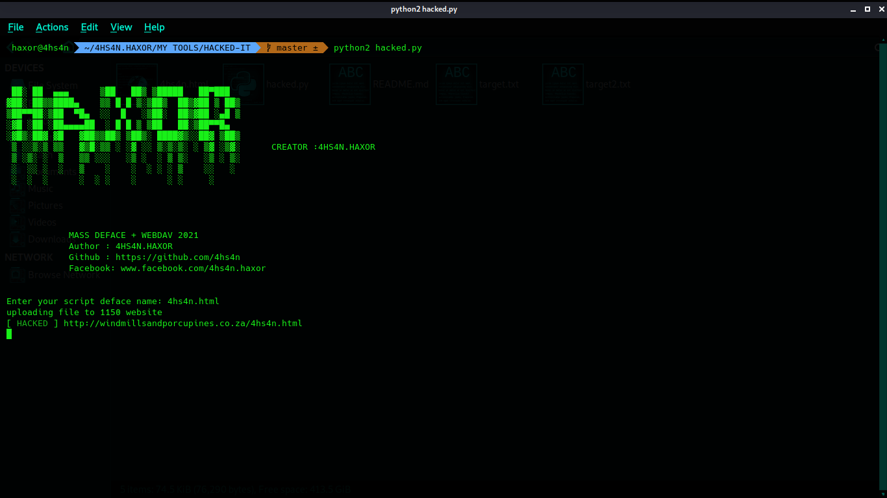

# HACKED-IT

there are many vuln site . try it [ for fun]

# INSTALL
1. apt-get update && apt-get upgrade
2. pkg install python2
3. pip2 install requests
4. pkg install git
5. git clone https://github.com/4hs4n/HACKED-IT-by-4hs4n.git
6. cd Massdav
7. python2 hacked.py

